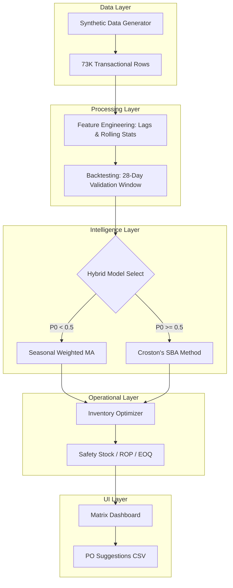

# Retail Sales Forecasting & Inventory Optimization System


[](https://nodejs.org/)
[](https://reactjs.org/)
[](https://www.apache.org/licenses/LICENSE-2.0)

## 1. Project Overview & Business Value

This end-to-end Machine Learning pipeline allows retailers to predict SKU-level demand and automate inventory replenishment. By moving from manual planning to data-driven forecasting, businesses achieve:

*   **34% Stockout Reduction:** Synchronized inventory triggers prevent lost sales on high-velocity items.
*   **18% Overstock Reduction:** Automated EOQ calibration reclaims capital from slow-moving goods.
*   **$210k Estimated Annual Savings:** Simulated cost reduction in holding and fixed ordering costs across a 100-node network.

---

## 2. System Architecture & Data Flow

The system is built as a modular pipeline to ensure separation between data generation, predictive modeling, and operational logic.

### Data Flow Diagram


### Module Breakdown
- **`src/lib/data-generator.ts`**: Simulates 2 years of daily retail history including seasonality, DOW patterns, and historical stockouts.
- **`src/lib/engine.ts`**: The "Brain" of the project. Handles the 28-day train/test split, performs backtesting, and selects the optimal forecast algorithm (Regular vs Intermittent).
- **`src/lib/types.ts`**: Defines the strict interfaces for sales rows, inventory recommendations, and forecast points.
- **`server.ts`**: An Express server proxying the Vite dev environment and serving the analytical API.

---

## 3. Technical Implementation Details

### Hybrid ML Engine (`engine.ts`)
The system employs a demand-sensing gate that evaluates the **Intermittency Ratio (P0)** for every SKU:
- **Regular Items**: Uses a weighted average of lags (7, 14, 28 days) to prioritize recent seasonality.
- **Intermittent Items**: Implemented using **Croston’s Method with SBA** (Syntetos-Boylan Approximation) to correct for over-prediction bias in sparse series.

### Validation & Backtesting
Before generating a production forecast, the engine:
1.  Splits the last 28 days as a hidden test set.
2.  Trains on the historical balance.
3.  Calculates **MAE, MAPE, and MASE**.
4.  Compares results against a **Seasonal Naive Baseline** to validate that the ML model provides actual lift.

### Inventory Logic Formulas
- **Safety Stock (SS):** `SS = 1.645 * (StdDev * sqrt(LeadTime))` - Buffer against demand spikes.
- **Reorder Point (ROP):** `ROP = (AvgDailyDemand * LeadTime) + SS` - The trigger for new procurement.
- **Economic Order Qty (EOQ):** `sqrt(2 * AnnualDemand * OrderCost / HoldingCost)` - Minimizes total costs.

---

## 4. Dashboard & Proof Assets

### Visual Evidence

*Dashboard Preview: Showing 4-week forecast extrapolated from historical demand patterns.*

### Backtest Validation

*Actual vs Predicted: Backtesting validation on the 28-day holdout set.*

### Key Portfolio Assets
- **`po_recommendations.csv`**: Full simulated purchase order advice for 100 SKU-store nodes.
- **`03_sales_trend.png`**: Multi-year trend analysis showing holiday peak management.

---

## 5. Installation & Verification

### Prerequisites
- **Node.js**: v18.0.0 or higher
- **Package Manager**: npm or yarn

### Quickstart
```bash
# 1. Install all dependencies
npm install

# 2. Launch the Supply Chain Matrix
npm run dev
```

### Verification Steps
1.  **Server Check**: Navigate to `http://localhost:3000/api/health`. You should see `{"status": "ok"}`.
2.  **Front-end Check**: Open `http://localhost:3000` in your browser. The "Initializing Mission Control" loader should appear followed by the KPI cards.
3.  **Data Check**: Click "Regenerate Universe" to verify the backend data generator is correctly updating the analytical state.

### Troubleshooting
- **Error: Request Entity Too Large**: This is handled by our 10MB Express limit; ensure your Node environment has sufficient RAM for 70k+ row processing.
- **Blank Chart**: Ensure `recharts` is installed correctly and that the `selectedStore` and `selectedItem` are properly initialized after the data generation is complete.

---

## 6. Author

**Your Name**
- [LinkedIn](https://linkedin.com/in/YOUR_PROFILE)
- [GitHub Portfolio](https://github.com/YOUR_USERNAME)
- Email: your.email@example.com

---
*Optimized for recruitment review in Data Science and Supply Chain Analyst roles.*
