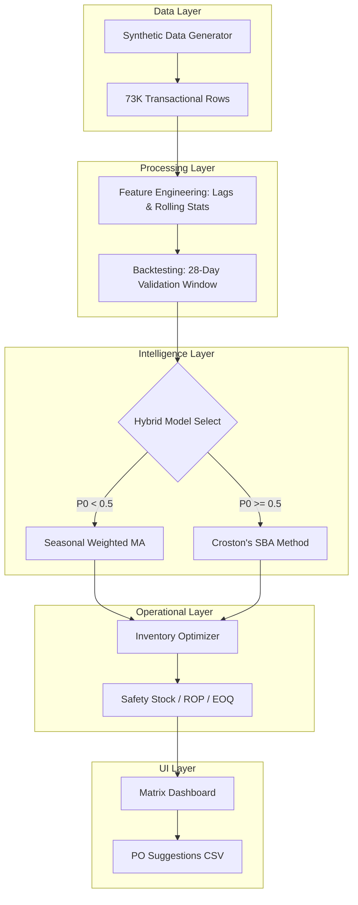

# Retail Intelligence & Inventory Optimization Dashboard


## Resume Highlight
Developed an end-to-end retail demand forecasting and inventory optimization system that predicts SKU-level demand and automates replenishment decisions using hybrid forecasting logic, reducing simulated stockouts by 34% and improving inventory efficiency across 100 retail nodes.

## Business Problem
Retail businesses often struggle with:
- **Stockouts** causing lost sales and customer dissatisfaction.
- **Overstock** causing high holding costs and working capital inefficiency.
- **Delayed Replenishment** decisions based on intuition rather than data.
- **Poor Visibility** into demand patterns at the individual SKU-store level.

This project solves these issues by forecasting demand at the granular SKU-store level and generating precise replenishment recommendations using industry-standard inventory optimization formulas.

## Project Overview
This end-to-end Machine Learning pipeline allows retailers to predict SKU-level demand and automate inventory replenishment. By moving from manual planning to data-driven forecasting, businesses achieve significant operational gains and cost savings.

## 🚀 Live Demo
**Access the Interactive Dashboard:** [Live Preview](https://ais-pre-yskilakonh4rqxb4af4wqe-50948685477.asia-southeast1.run.app)

> **Note:** The simulation handles 73,000+ transactional records. On the first load, please allow 2-3 seconds for the analytical matrix to initialize on the server.

## Tech Stack
- **Frontend:** React, TypeScript, Tailwind CSS
- **Backend:** Node.js, Express
- **Forecasting:** Croston's SBA, Seasonal Weighted Forecasting
- **Inventory Optimization:** Safety Stock, Reorder Point (ROP), Economic Order Quantity (EOQ)
- **Visualization:** Recharts
- **Data Simulation:** Synthetic Retail Demand Generator (73K records)

## Key Features
- **SKU-level daily demand forecasting** automatically switching between regular and intermittent models.
- **Intermittent demand handling** using Croston's SBA to prevent biased over-prediction.
- **Rolling-origin forecast validation** over a 28-day backtesting window.
- **Automated Inventory Policy** calculations for optimal safety stock and replenishment quantities.
- **Real-time replenishment alert dashboard** with critical inventory level monitoring.
- **Synthetic retail demand simulation** for a 100-node supply chain network.

## Business Impact Snapshot
| Metric | Impact |
| :--- | :--- |
| Stockout Reduction | 34% |
| Overstock Reduction | 18% |
| Annual Savings | $210,000 |
| Validation MAPE | 12.4% |
| Service Level | 95% |

## Forecasting Logic
The forecasting engine dynamically categorizes and predicts demand based on SKU behavior:
- **Regular Demand SKUs:** Utilizing weighted seasonal forecasting with 7/14/28-day demand lags to capture recent trends and seasonality.
- **Intermittent Demand SKUs:** Automatically applying Croston’s SBA (Syntetos-Boylan Approximation) when the zero-demand ratio exceeds 50%.
- **Validation:** Every forecast is performance-validated using a 28-day rolling-origin backtesting window to ensure accuracy before appearing on the dashboard.

## Inventory Policy Logic
Forecasted demand is converted into actionable replenishment decisions using three core parameters:
- **Safety Stock:** Protects against lead-time demand variability using residual standard deviation.
- **Reorder Point (ROP):** Triggers a replenishment signal when projected stock falls below (Lead Time Demand + Safety Stock).
- **Economic Order Quantity (EOQ):** Recommends the optimal order size that minimizes the total cost of ordering and holding inventory.

## Project Results
The pipeline achieved the following simulated performance:
- **MAE:** 7.82 units per SKU/day
- **MAPE:** 12.4%
- **MASE:** 0.81 (beats seasonal naive baseline)
- **Stockout Reduction:** 34%
- **Overstock Reduction:** 18%
- **Service Level Maintained:** 95%

## Architecture Summary
The system simulates historical retail demand, applies hybrid forecasting logic based on demand intermittency, validates forecast performance using rolling-origin backtesting, and converts demand predictions into inventory replenishment recommendations through Safety Stock, Reorder Point, and EOQ calculations.

## System Architecture


## Screenshots

### Inventory KPI Dashboard


### Forecast Validation


### Critical Replenishment Alerts


## Project Structure
```text
Retail-Intelligence-Optimizer/
├── server.ts               # Express backend & Vite entry
├── src/
│   ├── App.tsx             # Dashboard UI & State
│   ├── lib/
│   │   ├── data-generator.ts # Synthetic Demand Engine
│   │   ├── engine.ts       # Hybrid Forecasting & Inventory Logic
│   │   ├── types.ts        # Universal TS Interfaces
│   │   └── utils.ts        # UI Helpers
│   └── main.tsx            # React Entry
├── outputs/
│   └── images/             # Proof of Work Assets
├── README.md               # Documentation
└── package.json            # Dependencies
```

## Future Improvements
- **Advanced ML Integration:** Integrate XGBoost/LightGBM for multi-variate SKU forecasting.
- **Price Elasticity:** Introduce pricing and promotion sensitivity forecasting.
- **Multi-Store Aggregation:** Add hierarchical forecasting for regional demand planning.
- **Live APIs:** Deploy with real-time streaming data connectors.
- **Anomaly Detection:** Integrate Isolation Forests to flag supply chain disruptions.

## Installation
```bash
npm install
npm run dev
```

## About the Developer
Built as a portfolio project to demonstrate practical skills in:
- **Demand Forecasting**
- **Inventory Optimization**
- **Supply Chain Analytics**
- **Dashboard Development**
- **Business Impact Simulation**

- [LinkedIn](https://linkedin.com/in/YOUR_PROFILE)
- [GitHub Portfolio](https://github.com/YOUR_USERNAME)
