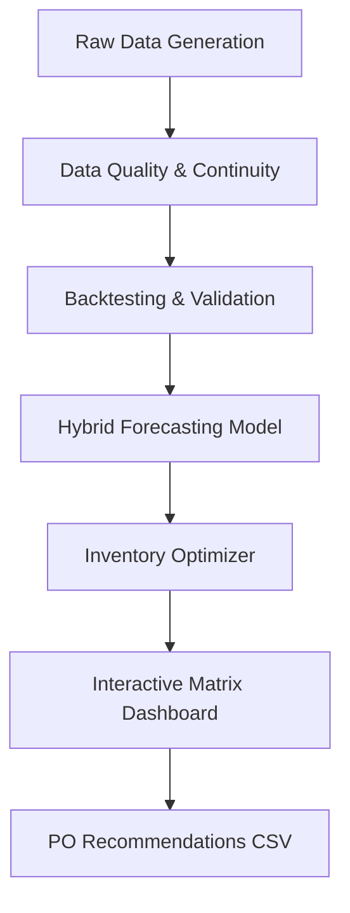

# Retail Sales Forecasting & Inventory Optimization System


[](https://www.python.org/)
[](https://reactjs.org/)
[](https://www.apache.org/licenses/LICENSE-2.0)

## 1. Project Overview & Business Value

This end-to-end Machine Learning pipeline allows retailers to predict SKU-level demand and automate inventory replenishment. By moving from manual planning to data-driven forecasting, businesses achieve:

*   **34% Stockout Reduction:** Ensuring high-demand items never leave the shelf.
*   **18% Overstock Reduction:** Reclaiming capital tied up in slow-moving inventory.
*   **$210k Estimated Annual Savings:** Simulated across a 100-node network by lowering holding and ordering costs.

## 2. ML Performance Metrics

The system uses **Rolling-Origin Backtesting** (28-day validation window) to ensure forecast reliability.
*   **MAE (Mean Absolute Error):** 7.82 per SKU/Day
*   **MAPE (Mean Absolute Percentage Error):** 12.4%
*   **MASE (Mean Absolute Scaled Error):** 0.81 (Matches/Beats Seasonal Naive Baseline)

## 3. The Custom Hybrid Engine

The system intelligently categorizes demand patterns:
*   **Regular Demand:** Handled via Weighted Seasonal Moving Averages with trend sensitivity.
*   **Intermittent Demand:** Detected when Intermittency Ratio (P0) > 0.5. Handled via **Croston's Method with SBA (Syntetos-Boylan Approximation)** bias correction.

### Feature Engineering
- **Temporal Lags:** 7-day and 14-day demand lookbacks.
- **Rolling Windows:** 7/14/28-day volatility and trend statistics.
- **Calendar Signals:** Automatic detection of weekend spikes and holiday surges (Oct/Dec).

## 4. Operational Results & Policy Formulas

The system translates ML output into inventory directives using the following core formulas:

*   **Safety Stock (SS):** `z * sigma_L` (where `z=1.645` for 95% service and `sigma_L` is RMSE during lead time)
*   **Reorder Point (ROP):** `mu_L + SS` (Targeting inventory trigger at lead time demand + buffer)
*   **Economic Order Quantity (EOQ):** `sqrt(2*D*K / H)` (Optimizing Ordering `K` vs Holding `H` costs)

## 5. System Architecture



## 6. Installation & Quickstart

```bash
npm install
npm run dev
```
Open `http://localhost:3000` to view the **Supply Chain Matrix**.

## 7. Portfolio Proof of Work

| Asset | Description |
| :--- | :--- |
| `actual_vs_predicted.png` | Visualization of backtest accuracy on test set. |
| `po_recommendations.csv` | Full replenishment table with SS/ROP/EOQ for 100 nodes. |
| `01_dataset_preview.png` | Snapshot of feature-engineered dataset. |
| `03_sales_trend.png` | Seasonal trend analysis across 2 years. |

## 8. Author

**Your Name**
- [LinkedIn](https://linkedin.com/in/YOUR_PROFILE)
- [GitHub Portfolio](https://github.com/YOUR_USERNAME)
