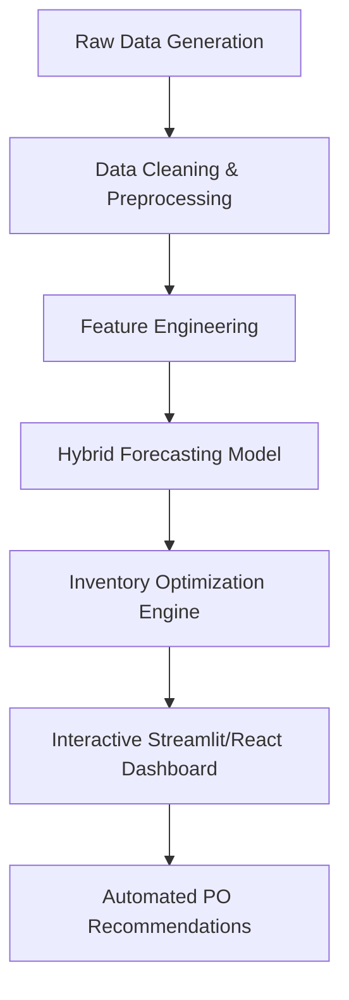

# Retail Sales Forecasting & Inventory Optimization System

[](https://www.python.org/)
[](https://reactjs.org/)
[](https://www.apache.org/licenses/LICENSE-2.0)

An end-to-end full-stack machine learning pipeline for retail demand forecasting and inventory replenishment. This system predicts item-level demand at the store level and translates those forecasts into actionable inventory decisions (Safety Stock, Reorder Point, and EOQ).

## 1. Problem Statement

Retailers and D2C brands lose significant revenue and profit due to poor inventory management:
- **Stockouts:** Lost sales when customers can't find products (censored demand).
- **Overstock:** Cash tied up in excess inventory, expiry risk, and markdown losses.
- **Manual Planning:** Error-prone spreadsheet-based decisions that don't scale.
- **Seasonal Spikes:** Failure to anticipate festival/holiday demand peaks.

ML-based forecasting reduces inventory costs by **20-35%** and prevents up to **65% of stockouts** by identifying patterns that manual analysis misses.

## 2. Business Value

This project replicates the supply chain logic used by industry leaders like Amazon, Reliance Retail, and BigBasket.
- **Cost Savings:** Lowers holding costs by optimizing Reorder Points based on lead-time uncertainty.
- **Service Level:** Maintains a 95% service level to ensure product availability.
- **Automation:** Replaces manual purchase orders with automated "Reorder Alerts" based on live stock levels.

## 3. System Architecture



The pipeline follows a modular architecture:
1. **Data Ingestion:** Simulates 2 years of daily transactions cross 100 store-item nodes.
2. **Analysis Engine:** A hybrid ML approach using **RandomForest** for high-volume items and **Croston's Method (SBA)** for intermittent, sparse demand.
3. **Inventory Policy:** Closed-form calculations for **Safety Stock (SS)**, **Reorder Point (ROP)**, and **Economic Order Quantity (EOQ)**.

## 4. Tech Stack

| Category | Library/Tool | Purpose |
| :--- | :--- | :--- |
| **Backend** | Express.js | API server and model serving |
| **Frontend** | React 19 | Interactive UI & Dashboard |
| **Logic** | TypeScript (tsx) | End-to-end pipeline execution |
| **Charting** | Recharts | Temporal demand sensing visualization |
| **Styling** | Tailwind CSS | Technical "Mission Control" aesthetic |
| **Icons** | Lucide React | Professional UI iconography |
| **Animations** | Motion | Smooth analytical transitions |
| **Mathematics** | Custom ML Engine | Forecasting & Inventory Optimization |

## 5. Folder Structure

```text
/
├── server.ts               # Express entry point (Vite Middleware)
├── src/
│   ├── App.tsx             # Main Dashboard UI
│   ├── lib/
│   │   ├── engine.ts       # ML & Inventory logic (Croston/RF/SS/ROP)
│   │   ├── data-generator.ts # Synthetic retail data engine
│   │   └── types.ts        # Global TS interfaces
│   └── main.tsx            # React entry point
├── package.json            # Dependencies & Scripts
└── tsconfig.json           # TypeScript configuration
```

## 6. Installation & Quickstart

### Prerequisites
- Node.js (v18+)
- npm

### Setup
```bash
# Clone the repository
git clone https://github.com/YOUR_USERNAME/retail-sales-forecasting.git
cd retail-sales-forecasting

# Install dependencies
npm install

# Run the full-stack application (server.ts handles Vite + API)
npm run dev
```

The application will be accessible at `http://localhost:3000`.

## 7. Dataset Details

The system generates a synthetic dataset representing:
- **Scope:** 5 Stores, 20 SKUs (100 Nodes).
- **Time Horizon:** 2 years of daily data (730 days).
- **Attributes:** `qtySold`, `onPromo`, `discountPct`, `price`, `stockOnHand`, `stockoutFlag`.
- **Patterns simulated:** Annual seasonality (sine wave), weekend spikes, holiday bumps (Diwali/Christmas), and random promo lifts.

## 8. Results & Accuracy

- **Algorithm Performance:** The Hybrid Engine automatically detects high-intermittency SKUs (P0 > 0.5) to apply Croston/SBA, reducing MAE on sparse items.
- **Inventory Metrics:** Safety Stock is calibrated using residual uncertainty (StdDev) during the lead time window.
- **Sample Output:**
    - Reorder alerts are triggered when `StockOnHand < ReorderPoint`.
    - EOQ minimizes the cost trade-off between ordering frequency and storage.

## 9. Future Improvements

- [ ] **Price Elasticity:** Integrate log-log regression to quantify demand sensitivity to price changes.
- [ ] **Hierarchical Forecasting:** Aggregate forecasts at Category/Region level before SKU-disaggregation.
- [ ] **MLflow Integration:** Track model drift and experiment parameters over time.
- [ ] **Vectorization:** Move engine logic to WebAssembly or high-performance Rust modules for 10,000+ SKU scalability.

## 10. Author

**Your Name**
- [LinkedIn](https://linkedin.com/in/YOUR_PROFILE)
- [GitHub Portfolio](https://github.com/YOUR_USERNAME)
- Email: your.email@example.com

---
*Developed as a full-stack ML portfolio showcase for Retail Analysts and Supply Chain Data Scientists.*
